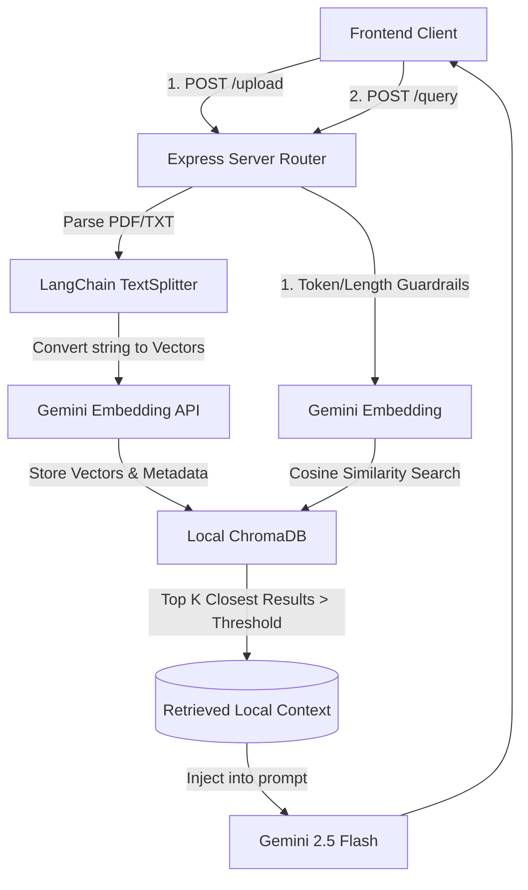

# 🚀 Enterprise RAG Chat Application

A premium, localized **Retrieval-Augmented Generation (RAG)** application built with a modern React Frontend , an Express/NodeJS backend, LangChain, and **Google Gemini 2.5 Flash**.

This application maps user uploads into **ChromaDB** to securely restrict Gemini AI behavior exclusively to the boundaries of the uploaded documents.

---

## 🎨 Premium UI & User Experience
- **Liquid Glassmorphism:** Features a sleek dark theme (`#020617`), radial glow spotlights, and frosted `<backdrop-filter>` interfaces mimicking premium OS-level assistant interactions.
- **Floating Input:** Contextual chat bar suspended cleanly at the bottom of the viewport.
- **Fluid Animation:** Messages animate gracefully using `framer-motion` spring physics.
- **Dynamic Guardrails Settings:** End-users dynamically control backend vector limits (Chunk Size, Overlapse, Top K limits, Similarity Scores) without restarting the Node server.

---

## 🏗 System Architecture Flow



### Core Components
1. **Frontend (`/frontend`)**: React + TypeScript + Vite. Extracts all global settings states and pipelines them downstream. 
2. **Backend (`/backend`)**: Express API that exposes strictly two endpoints: `/upload` and `/query`.
3. **Database (`ChromaDB`)**: SQLite local vector persistence. Ensures history loss prevention on server restarts.
4. **Vector Store Mapping**: 
   - Files are extracted via `pdf-parse`.
   - Chunked using `RecursiveCharacterTextSplitter`.
   - Converted via `@langchain/google-genai`.
   - Stored in a physical `db`, queried via `cosine search`.

---

## 🛡 Token Guardrails & Robustness

To ensure safety and prevent tokenizer burnout (or API crashes):
- **Query Capping**: The Node router immediately throws HTTP `400` if a user attempts to send a query exceeding **500 Characters**.
- **Context Injection Slicing**: If extreme retrieval sizes are provided, context strings are securely truncated to **8,000 Characters** before injecting into the LLM context buffer.
- **History Pruning**: Conversational History memory is hard-capped to **2,000 Characters**.
- **Out of Bound Rejections**: Setting the `similarityThreshold` strictly restricts the LLM from hallucinating. If zero documents pass the vector distance calculation, the LLM bypasses generation entirely and returns: *"This question is outside the scope of uploaded documents."*

---

## 🛠 Local Setup Instructions

### Prerequisites
- NodeJS (v18+)
- Python 3
- Native UNIX Environment (MacOS / Linux)

### 1. Database Initialization (Crucial)
ChromaDB requires a lightweight Python HTTP server proxy. From the project root, run:
```bash
./run_chroma.sh
```
*Leave this terminal window running. It starts the backend persistent database on `http://localhost:8000`.*

### 2. Backend Initialization
Open a **new** terminal window:
```bash
cd backend
npm install
# Create a .env file and add your GEMINI_API_KEY
npm run dev
```

### 3. Frontend Initialization
Open a **third** terminal window:
```bash
cd frontend
npm install
npm run dev
```

Access the UI locally at `http://localhost:5173`.

---

## 🚧 Known Limitations & Future Enhancements
- **No Document Management Sidebar**: Currently, old session threads can be fully wiped via the "Reset Session" button, but there is no side-bar to toggle backward between multiple active sessions simultaneously.
- **File Parsing Constraints**: Only handles `.pdf` and `.txt`. A future improvement would parse `.docx`, `.csv`, or webpage URLs.
- **Token Precision**: We currently enforce character-based heuristic approximation (~ 4 characters / token) for LLM guardrails. Future enhancements could implement exact `tiktoken` byte-level encoding metrics.
