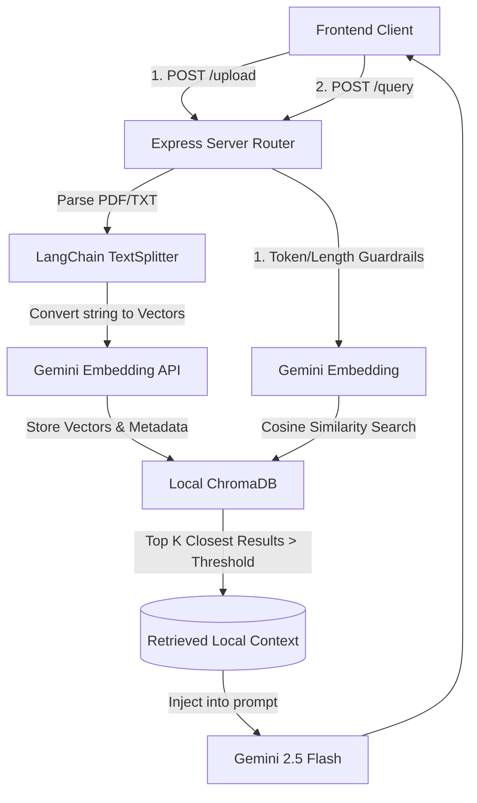

# 🚀 Enterprise RAG Chat Application

A premium, localized **Retrieval-Augmented Generation (RAG)** application built with a modern React Frontend , an Express/NodeJS backend, LangChain, and **Google Gemini 2.5 Flash**.

This application maps user uploads into **ChromaDB** to securely restrict Gemini AI behavior exclusively to the boundaries of the uploaded documents.

---

## 💻 Frontend Features & UI

The frontend application empowers you with a stunning user experience alongside fine-grained runtime control over the background RAG pipeline.

### Design
- **Liquid Glassmorphism:** Features a sleek dark theme (`#020617`) with radial glow spotlights and frosted `<backdrop-filter>` interfaces, mimicking premium OS-level interactions.
- **Floating Input & Fluid Animations:** The contextual chat bar is suspended cleanly at the bottom of the viewport, with messages animating gracefully via `framer-motion` spring physics.
- **Mobile Responsive:** Fully adaptive CSS architecture ensuring seamless scaling across all desktop and mobile device viewports.

### Configurable Retrieval Settings
You can dynamically explicitly tweak backend vector metrics strictly from the frontend without ever restarting the Express server. The following metrics are easily configurable:
- **Chunk size**: Adjust the character limit for document text splitting.
- **Chunk overlap**: Control the context retention shared between adjacent chunks.
- **Top K**: Dictate the absolute number of contextual vectors retrieved.
- **Similarity threshold**: Command how strictly the LLM filters out low-matching chunks to prevent hallucinations.


### Active Document Management & Zero Hallucination
- **Active Documents Sidebar**: A dedicated panel that dynamically lists all uploaded and vectorized files resident in the current knowledge base.
- **Multi-Document Retrieval**: The chatbot seamlessly supports concurrent multi-document retrieval. Users can choose to clear the context completely to start a new session, or continue querying across all historically uploaded documents within their active session. 
- **Clear Chat & Session Reset**: Easily erase the current conversation via "Clear Chat" or fully purge all vectorized documents and start fresh via "Reset Session".
- **Zero Hallucination Guarantee**: Because the UI strictly manages active context files and locks queries when empty, the AI is 100% constrained to ground its answers exclusively in the uploaded sources. Each response strictly traces back to the source attribution to ensure transparency and utterly prevent hallucinations.


---

## 🏗 System Architecture Flow



### Core Components
1. **Frontend (`/frontend`)**: React + TypeScript + Vite. Extracts all global settings states and pipelines them downstream. 
2. **Backend (`/backend`)**: Express API that exposes strictly two endpoints: `/upload` and `/query`.
3. **Database (`ChromaDB`)**: SQLite local vector persistence. Ensures history loss prevention on server restarts.
4. **Vector Store Mapping**: 
   - Files are extracted via `pdf-parse`.
   - Chunked using `RecursiveCharacterTextSplitter`.
   - Converted via `@langchain/google-genai`.
   - Stored in a physical `db`, queried via `cosine search`.

---

## 🛡 Token Guardrails & Robustness

To ensure safety and prevent tokenizer burnout (or API crashes):
- **Query Capping**: The Node router immediately throws HTTP `400` if a user attempts to send a query exceeding **500 Characters**.
- **Context Injection Slicing**: If extreme retrieval sizes are provided, context strings are securely truncated to **8,000 Characters** before injecting into the LLM context buffer.
- **History Pruning**: Conversational History memory is hard-capped to **2,000 Characters**.
- **Out of Bound Rejections**: Setting the `similarityThreshold` strictly restricts the LLM from hallucinating. If zero documents pass the vector distance calculation, the LLM bypasses generation entirely and returns: *"This question is outside the scope of uploaded documents."*

---

## 🔐 Session Management & Isolation

To guarantee precise memory usage and strict data isolation, the application enforces the following behaviors:

### Session Management
- **Automatic Generation:** Generates a unique `sessionId` immediately when the user first loads the app. 
- **Console Transparency:** Upon every page refresh, payload creation, or manual session reset, the complete, un-truncated UUID session string is explicitly logged to the browser console for developer transparency, while a cleanly cropped, aesthetic version is displayed in the primary UI header.
- **Data Encapsulation:** All uploaded documents and embeddings must be and are completely isolated per session.
- **Complete Erasure:** Provides a dedicated frontend endpoint and backend route (`POST /session/reset`) to completely reset/clear active session data.

### Session Isolation
- **No Data Leakage:** The persistent Vector Store architecture absolutely guarantees no data leakage between different active sessions.
- **Strict Validation:** All backend APIs strictly validate the session identity (`x-session-id` headers) on every single incoming API request.

---

## 🔍 Enterprise Observability with LangSmith

This project is deeply instrumented with **LangSmith** to provide production-grade tracing, monitoring, and debugging across the entire RAG pipeline. This goes far beyond basic console logging.

**Enhanced Observability Features:**
- **Full Execution Tracing**: Every user query generates a unique, deterministic `Query-[UUID]`, allowing you to trace the exact waterfall of latency operations from the incoming HTTP request down to the final LLM response string.
- **Custom Tool Tracking (`@traceable`)**: Beyond standard LangChain instrumentation, we deployed explicit `@traceable` decorators onto bespoke internal methods. This tracks the precise latency and payload data of:
  - PDF/Text Buffer Extraction (`run_type: "tool"`)
  - Document Chunking & Vector Creation 
  - ChromaDB Native Insertion Queries 
  - ChromaDB Vector Retrieval (`run_type: "retriever"`)
- **Metadata Injection**: Each trace dynamically attaches the active `session_id`, logging it directly into the LangSmith dashboard. This guarantees you can analyze user journeys, identify hallucination paths, or debug isolated retrieval failures on a strict per-user basis.

### Dashboard Preview


---

## 📦 Third-Party Packages Used

### Frontend (User Interface)
- **`react` / `react-dom`**: The core component-based UI library.
- **`framer-motion`**: A production-ready animation library that provides the liquid physics, layout spring transitions, and micro-interactions for the Premium UI.
- **`lucide-react`**: A beautiful, consistent open-source icon set used throughout the application.
- **`vite`**: The next-generation frontend tooling offering instant, lightning-fast Hot Module Replacement (HMR) for development.

### Backend (API & Orchestration)
- **`express`**: The minimalist, unopinionated routing framework powering the REST API endpoints.
- **`multer`**: Middleware utilized to handle `multipart/form-data`, gracefully buffering uploaded local PDF and text files in memory.
- **`pdf-parse`**: A robust utility that extracts raw string text blocks from buffered PDF binaries.
- **`@langchain/core` / `langchain`**: The standard AI framework providing abstractions for Document mapping, `RecursiveCharacterTextSplitter`, and LLM chain architectures.
- **`@langchain/google-genai`**: The official SDK bridge to authenticate and communicate with Google's Gemini 2.5 Flash and their optimized embedding models.
- **`chromadb`**: The official Node.js HTTP client to communicate with the physical persistent Chroma SQLite vector store.
- **`langsmith`**: The observability SDK used natively inside backend routers to log trace telemetry and tool execution durations.

---

## 🛠 Local Setup Instructions

### Prerequisites
- NodeJS (v18+)
- Python 3
- Native UNIX Environment (MacOS / Linux)

### 1. Database Initialization (Crucial)
ChromaDB requires a lightweight Python HTTP server proxy. From the project root, run:
```bash
./run_chroma.sh
```
*Leave this terminal window running. It starts the backend persistent database on `http://localhost:8000`.*

### 2. Backend Initialization
Open a **new** terminal window:
```bash
cd backend
npm install
# Create a .env file and add your GEMINI_API_KEY
npm run dev
```

### 3. Frontend Initialization
Open a **third** terminal window:
```bash
cd frontend
npm install
npm run dev
```

Access the UI locally at `http://localhost:5173`.

---

## 🚧 Known Limitations & Future Enhancements

The application is continually evolving. Later iterations of the chatbot will be enhanced with:
- **Per-Document Filtering (Document Selectors)**: Currently, the LLM analyzes all uploaded documents collectively to synthesize a response. A future update will introduce semantic checkboxes inside the Active Documents sidebar, allowing users to explicitly restrict LLM retrieval to specific subsets of uploaded files rather than the entire available database.
- **Expanded File Support**: The parser presently only handles `.pdf` and `.txt`. Future pipeline improvements will integrate parsing mechanisms for `.docx`, `.csv`, and direct webpage URL scraping.
- **Exact Token Precision**: We currently enforce character-based heuristic approximation (~ 4 characters / token) for LLM guardrails out of caution. Future enhancements will implement strict `tiktoken` byte-level encoding metrics for exact capacity boundary calculations.
